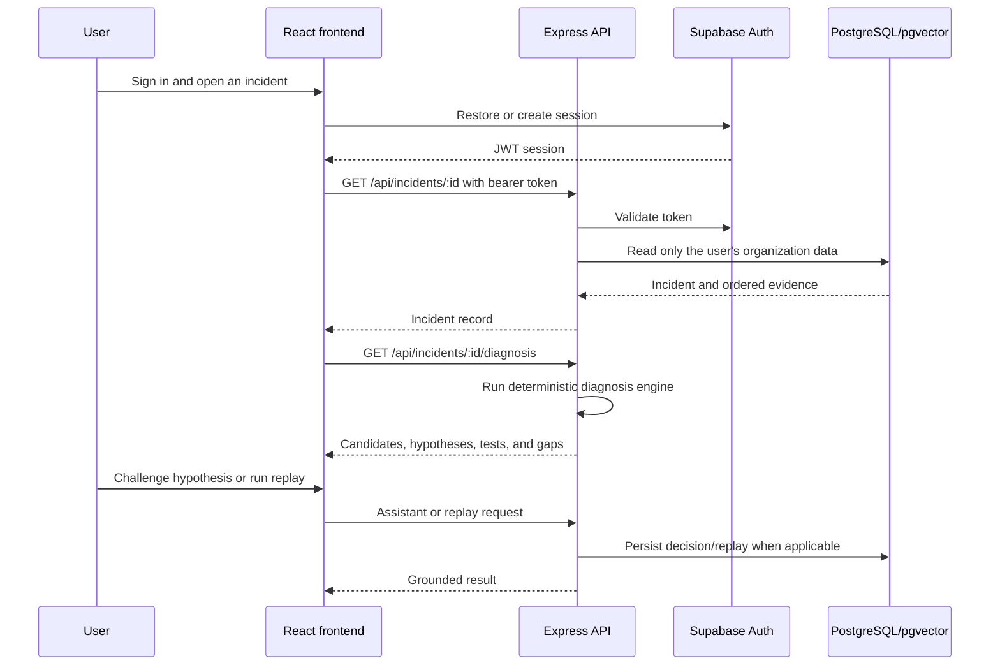

# ReplayOps Code Walkthrough and Decision Record

This document explains what ReplayOps does, how the code is organized, why the important product and engineering decisions were made, and how a new user can run or evaluate the application.

## 1. What ReplayOps Is

ReplayOps is a production-incident debugging workbench. It does not try to replace Datadog, Grafana, Honeycomb, PagerDuty, Rootly, or similar systems. Those products remain the sources of telemetry, alerts, and response coordination.

ReplayOps addresses the reasoning gap between seeing telemetry and deciding what to do:

```text
recorded evidence
      ↓
likely precursor and first symptom
      ↓
competing, falsifiable hypotheses
      ↓
next safe diagnostic test
      ↓
reviewable mitigation decision
      ↓
counterfactual replay
      ↓
auditable handoff
```

The core product principle is: **AI may challenge a diagnosis, but evidence and the human responder decide.**

## 2. Features Available Today

### Authentication and private workspaces

- Email/password authentication through Supabase.
- Optional GitHub social login when the provider is configured.
- Persistent browser sessions and protected application routes.
- A private organization is provisioned automatically for every new Supabase user.
- PostgreSQL row-level security and server-side membership checks isolate organizations.
- A synthetic incident workspace is automatically seeded for new accounts so the product is useful immediately.

### Incident operations

- Create, inspect, update, and delete incidents.
- Add, edit, and delete timestamped evidence events.
- Record alerts, deployments, dependency changes, metrics, actions, and recoveries.
- Optimistic frontend updates with rollback when a request fails.
- Responsive dashboard, incident ledger, workbench, dark mode, and keyboard-accessible controls.

### Diagnostic proof loop

- Detect the first high-impact customer-visible alert rather than treating the largest metric as the cause.
- Rank earlier dependency, deployment, and metric events as trigger candidates.
- Reconstruct the ordered service propagation path.
- Generate multiple competing hypotheses.
- Show evidence that supports each hypothesis.
- Show evidence that could disprove each hypothesis.
- Recommend one concrete falsification test and one reversible production guardrail.
- Compare pre-symptom signals with the failure window.
- Expose missing evidence such as trace IDs, deployment information, recovery signals, or a healthy baseline.
- Cap confidence when the evidence is incomplete.

### AI and search

- Semantic incident search when embeddings are configured.
- PostgreSQL full-text or deterministic in-memory search when no AI key exists.
- A grounded assistant that receives only visible incident evidence.
- An adversarial review action that challenges the selected hypothesis and explains what observation would change the conclusion.
- Provider mode uses an OpenAI-compatible chat endpoint.
- Deterministic fallback mode keeps the workflow usable without an AI subscription.

### Mitigation replay and handoff

- Test retry ceilings, concurrency caps, and downstream timeout budgets without touching production.
- Compare recorded and projected peak impact.
- Estimate avoided high-impact events and recovery-time improvement.
- Persist replay runs for auditability.
- Record proposed, approved, or rejected hypotheses and mitigations.
- Generate a portable Markdown shift handoff from incident evidence, decisions, and the latest replay.

## 3. Repository Map

```text
ReplayOps/
├── apps/
│   ├── web/                         React/Vite frontend
│   │   └── src/
│   │       ├── components/
│   │       │   ├── CausalTrace.tsx
│   │       │   ├── ResponseConsole.tsx
│   │       │   ├── AssistantDrawer.tsx
│   │       │   └── AppShell.tsx
│   │       ├── pages/
│   │       │   ├── DashboardPage.tsx
│   │       │   ├── IncidentsPage.tsx
│   │       │   ├── IncidentWorkbenchPage.tsx
│   │       │   └── LoginPage.tsx
│   │       ├── providers/AuthProvider.tsx
│   │       ├── lib/api.ts
│   │       └── types.ts
│   └── api/                         Express/Node backend
│       ├── db/
│       │   ├── schema.sql
│       │   └── seed.sql
│       └── src/
│           ├── routes.ts
│           ├── repository.ts
│           ├── diagnosis.ts
│           ├── ai.ts
│           ├── auth.ts
│           ├── seed.ts
│           └── types.ts
├── PRODUCT.md                       Product strategy and positioning
├── DESIGN.md                        Visual design system
├── Dockerfile                       Render backend image
├── vercel.json                      Frontend deployment configuration
└── render.yaml                      Optional Render reference configuration
```

## 4. End-to-End Request Flow



## 5. Frontend Walkthrough

### Routing and access control

`apps/web/src/App.tsx` lazy-loads the major pages. `ProtectedApp` checks the authentication provider before rendering `AppShell`; unauthenticated users are redirected to `/login`.

### Authentication

`apps/web/src/providers/AuthProvider.tsx` supports three paths:

1. Supabase email/password or GitHub authentication.
2. The supplied evaluation account.
3. Local-only demo accounts when cloud configuration is absent.

The frontend sends the Supabase access token to the API. Local demo mode sends the explicit `demo-session` token.

### API client and server state

`apps/web/src/lib/api.ts` is the typed boundary between the UI and backend. TanStack Query manages remote state, caching, loading states, retries, and invalidation. Incident and event mutations use optimistic updates so the workbench responds immediately, then rolls back if the server rejects the change.

### Incident workbench

`apps/web/src/pages/IncidentWorkbenchPage.tsx` composes the debugging experience:

1. Automatically ingested or manually created incident identity, severity, status, owner, and duration.
2. `CausalTrace`, which shows evidence across services and time.
3. `ResponseConsole`, which owns diagnosis, decisions, replay, and handoff.
4. The editable evidence ledger.

### Response console

`apps/web/src/components/ResponseConsole.tsx` has four modes:

- **Diagnose:** ranked hypotheses, trigger candidates, signal deltas, evidence gaps, safe tests, and adversarial review.
- **Decisions:** persistent responder reasoning and approval state.
- **Replay:** deterministic counterfactual controls and before/after projections.
- **Handoff:** generated Markdown for the next responder.

Diagnosis is intentionally the default. A responder should see “what should I test next?” before administrative records.

## 6. Backend Walkthrough

### Authentication boundary

`apps/api/src/auth.ts` validates bearer tokens with Supabase before any `/api` route runs. The authenticated user ID becomes the organization-scoping key for repository operations.

### Routes

`apps/api/src/routes.ts` validates input with Zod and exposes:

| Method | Route | Purpose |
|---|---|---|
| `GET` | `/api/dashboard` | Dashboard incidents, service pressure, activity, and replay state |
| `GET/POST` | `/api/incidents` | List and create incidents |
| `GET/PATCH/DELETE` | `/api/incidents/:id` | Read, update, or delete one incident |
| `GET` | `/api/incidents/:id/diagnosis` | Produce the diagnostic proof loop |
| `POST/PATCH/DELETE` | `/api/incidents/.../events` | Manage evidence events |
| `GET/POST` | `/api/incidents/:id/decisions` | Read or record incident decisions |
| `POST` | `/api/incidents/:id/replays` | Run and persist a mitigation replay |
| `POST` | `/api/search` | Semantic or full-text incident search |
| `POST` | `/api/assistant` | Evidence-grounded assistant response |
| `GET/POST` | `/api/integrations` | List or create signed evidence receivers |
| `DELETE` | `/api/integrations/:id` | Remove a receiver while preserving copied incident evidence |
| `POST` | `/api/integrations/:id/test` | Run a labeled end-to-end ingestion test |
| `POST` | `/ingest/:id` | Receive signed GitHub or generic webhook deliveries |
| `POST` | `/ingest/:id/v1/:signal` | Receive OTLP HTTP/JSON traces, logs, and metrics |

### Repository abstraction

`apps/api/src/repository.ts` defines one interface with two implementations:

- `MemoryRepository` enables local development and automated tests without cloud services.
- `PostgresRepository` provides persistent, organization-scoped production storage.

This boundary keeps business logic testable and prevents frontend code from depending on the database provider.

### Diagnosis engine

`apps/api/src/diagnosis.ts` is deterministic and testable. Its major stages are:

1. Sort evidence chronologically.
2. Select the first alert at or above the high-impact threshold as the initial visible symptom.
3. Find eligible precursors before that symptom.
4. Score candidates using event type, temporal proximity, and impact progression.
5. Derive the ordered service path.
6. Compare signal impact before and during failure.
7. Generate competing hypotheses, disconfirming evidence, tests, and guardrails.
8. Calculate confidence from evidence volume, service coverage, recovery evidence, change evidence, and correlation IDs.
9. Report evidence gaps that prevent a stronger claim.

If there are no events, the engine returns no hypothesis. It does not invent an answer.

### AI layer

`apps/api/src/ai.ts` has two execution modes:

- **Provider mode:** calls configured embedding and chat-completion endpoints.
- **Deterministic mode:** provides evidence-derived search and adversarial-review responses when no key exists.

The system prompt requires the model to use supplied evidence, separate observation from hypothesis, cite incident codes, and state uncertainty.

### Replay engine

`simulateReplay` in `apps/api/src/repository.ts` computes a reproducible projection from:

- Retry ceiling
- Concurrency cap
- Downstream timeout
- Recorded incident peak
- Evidence coverage
- Presence of a recovery event

It is a portfolio-safe counterfactual model, not a production command executor. It never changes external infrastructure.

## 7. Database Model

The production schema is in `apps/api/db/schema.sql`.

| Table | Responsibility |
|---|---|
| `organizations` | Tenant/workspace identity |
| `organization_members` | User membership and admin/responder/viewer role |
| `incidents` | Incident record and optional embedding vector |
| `incident_events` | Ordered evidence with metadata |
| `incident_activities` | Human/system activity and encoded decision records |
| `replay_runs` | Stored replay execution summaries |
| `service_health_snapshots` | Current service indicators |
| `event_volume_samples` | Request/error time series |
| `integrations` | Workspace-owned GitHub, OTLP, and generic receivers |
| `ingestion_deliveries` | Idempotency and connector delivery health |
| `ingestion_signals` | Normalized evidence buffer and incident attachment state |

`pgvector` and an HNSW cosine index support semantic incident search. Row-level security restricts data to organization members. An `auth.users` trigger creates and seeds a private workspace for every new account.

## 8. Important Decisions and Why We Made Them

### Decision 1: Complement observability products instead of rebuilding them

**Choice:** Focus ReplayOps on diagnostic reasoning and counterfactual validation.

**Why:** Existing products already collect and query telemetry well. Rebuilding logs, traces, paging, chat rooms, status pages, and runbook automation would produce a weaker copy. ReplayOps becomes valuable when it converts evidence from those systems into a falsifiable argument.

### Decision 2: Rank multiple hypotheses

**Choice:** Never present one unqualified “AI root cause.”

**Why:** Temporal correlation and alert severity are not proof. Multiple hypotheses make uncertainty visible and reduce anchoring on the loudest alert or a familiar historical incident.

### Decision 3: Make every hypothesis falsifiable

**Choice:** Attach conflicting evidence, a next test, and a safe guardrail to every diagnosis.

**Why:** A hypothesis is operationally useful only when a responder knows what evidence could reject it and how to test it without increasing impact.

### Decision 4: Use AI as an adversarial reviewer

**Choice:** AI challenges the selected hypothesis but cannot approve it.

**Why:** Summaries save reading time, but autonomous root-cause declarations can create false confidence. Adversarial review uses the model where language reasoning helps while preserving human accountability.

### Decision 5: Keep the core workflow deterministic

**Choice:** Diagnosis ranking and replay work without an LLM key.

**Why:** Incident response cannot become unavailable because an AI provider is down, rate-limited, or too expensive. Deterministic outputs are also reproducible and straightforward to test.

### Decision 6: Distinguish the first symptom from the peak alert

**Choice:** Start diagnosis at the first high-impact alert and search backward for precursors.

**Why:** The highest-impact event is often a downstream victim. Searching backward from the first visible symptom better represents propagation and avoids equating impact with causality.

### Decision 7: Use one repository interface for memory and PostgreSQL

**Choice:** Business routes depend on `Repository`, not directly on SQL.

**Why:** New contributors can run and test the entire application for free, while production keeps PostgreSQL persistence and tenant isolation.

### Decision 8: Use existing activity storage for decision records

**Choice:** Decisions are encoded in `incident_activities` instead of requiring an immediate database migration.

**Why:** This allowed the deployed feature to remain backward-compatible with existing free-tier data. A dedicated normalized decisions table is appropriate when querying and workflow requirements become more complex.

### Decision 9: Use push-based connectors on the free deployment

**Choice:** Receive signed webhooks and OTLP HTTP/JSON in the existing API instead of running polling workers or a separate message broker.

**Why:** Push delivery works within Vercel, Render, and Supabase free tiers. It also keeps source-system credentials out of ReplayOps. Delivery IDs provide idempotency, while the database acts as a durable evidence buffer.

### Decision 10: Buffer ordinary changes before opening incidents

**Choice:** Store low-impact deployments and metrics without creating an incident. Open one only for an alert or impact score of 65 or higher, then backfill the previous 30 minutes of correlated evidence.

**Why:** Automatically creating an incident for every deploy would replace manual entry with alert noise. Buffering preserves precursor context without overwhelming the incident ledger.

### Decision 11: Derive connector credentials server-side

**Choice:** Derive a unique connector token from one deployment signing secret and the connector ID.

**Why:** No connector secret is committed to GitHub or stored in plaintext in the database. GitHub uses the token as its HMAC secret; generic and OTLP send it as a bearer/custom header.

### Decision 12: Label replay as synthetic

**Choice:** Replay results are estimates and never execute production commands.

**Why:** A safe portfolio deployment must not imply production certainty or require infrastructure credentials. Real execution would need isolated workers, signed manifests, approval policy, and complete auditing.

## 9. How Any User Can Try It

### Live application

Open: <https://replayops-incident-time-machine.vercel.app>

Evaluation credentials:

```text
Email: operator@replayops.dev
Password: ReplayOps!2026
```

Alternatively, create a new account. Supabase provisions a private workspace and seed incidents for the new user. Depending on the Supabase email configuration, the user may need to confirm the email address before signing in.

Suggested evaluation flow:

1. Open **Connectors** and create a Generic, GitHub, or OpenTelemetry receiver.
2. Run the labeled end-to-end test; it automatically creates a synthetic incident.
3. Return to **Incidents** and open that new incident.
4. Inspect the automated source metadata and causal trace.
5. In **Diagnose**, compare the ranked hypotheses and confidence blockers.
6. Select a different hypothesis and inspect its falsification test.
7. Ask AI to challenge the leading hypothesis.
8. Open **Decisions** and record a proposed mitigation.
9. Open **Replay**, change the controls, and run the counterfactual.
10. Open **Handoff** and copy or download the generated Markdown.

### Run locally for free

Requirements: Node.js 20 or newer.

```bash
cp .env.example .env
npm install
npm run dev
```

Open <http://localhost:5173>. Without Supabase, PostgreSQL, or an AI key, the application uses its local demo account, in-memory repository, deterministic search, and deterministic adversarial review.

### Run the checks

```bash
npm run typecheck
npm test
npm run build
```

## 10. Deployment

- Frontend: Vercel using `vercel.json`
- Backend: Render Web Service using the root `Dockerfile`
- Database/Auth: Supabase PostgreSQL, pgvector, and Auth
- Automation: pushes to `main` trigger Vercel and Render after their Git integrations are connected

Required variables are documented in `.env.example`. The frontend needs the public API and Supabase values. The backend needs the database URL, Supabase values, allowed frontend origin, and optional OpenAI-compatible provider values.

## 11. Current Limitations and Next Production Steps

The deployed application is fully usable as an interactive portfolio and architecture demonstration, but the following are intentionally not misrepresented as complete production integrations:

- GitHub, OpenTelemetry HTTP/JSON, Grafana, and normalized generic webhooks are implemented. Binary OTLP, Datadog-specific schemas, vendor OAuth installation flows, Kubernetes watches, and feature-flag adapters remain future work.
- Render's free service can sleep when idle, so the first webhook after inactivity may be delayed while it wakes. A production SLA would require an always-on service tier.
- The replay engine estimates outcomes; it does not execute a load test or production rollback.
- AI provider mode requires `OPENAI_API_KEY`; the deployed fallback remains deterministic without it.
- Decision records currently share the activity table.
- Real enterprise use should add audit export, retention policies, secret management, rate limits, connector health, and role-aware mutation rules at the API layer.

These boundaries are deliberate. ReplayOps should earn trust by clearly separating recorded evidence, deterministic inference, model-generated review, and synthetic projection.
