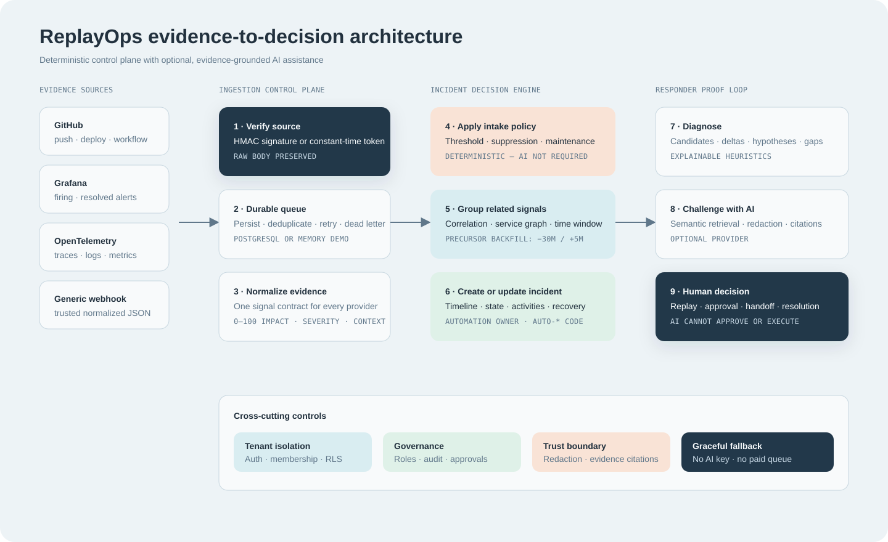
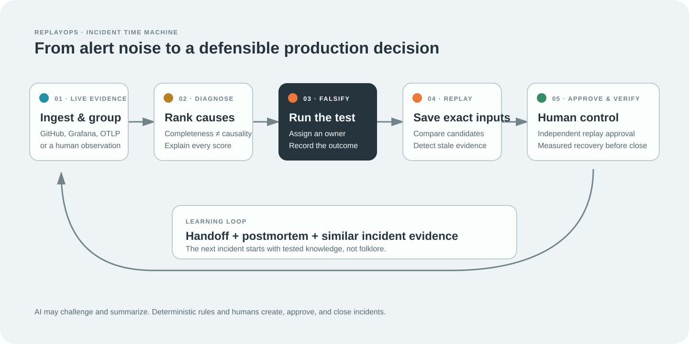
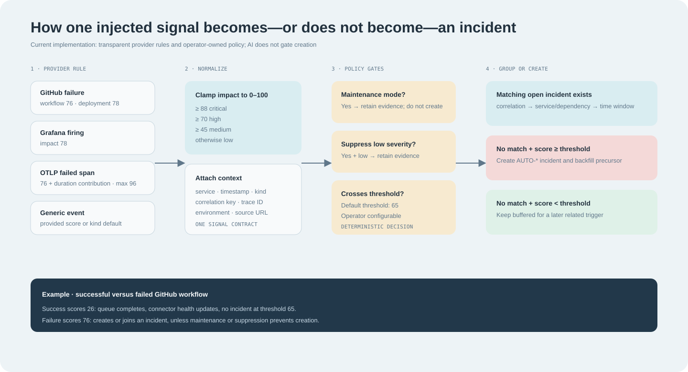

# ReplayOps: Every Feature, Explained With Code

This guide explains what ReplayOps does, why each feature exists, where it lives in the codebase, how data moves through it, and what is deterministic versus AI-assisted.



## 1. The product in one sentence

ReplayOps receives operational evidence from production tools, decides whether that evidence should open or join an incident, reconstructs the incident as a timeline, ranks testable hypotheses, and lets engineers replay a proposed mitigation before acting on production.



The key design boundary is:

> Deterministic rules decide whether an incident exists. AI helps search, explain, and challenge hypotheses, but it does not open, approve, or close incidents.

## 1.1 What changed in the production-debugging upgrade

| Responder problem | Implemented behavior | Primary code |
|---|---|---|
| An approval could accidentally use edited slider values | An approval now references one saved replay ID, its exact configuration, projection, event count, and evidence version. New evidence marks the request stale. | `repository.ts`, `workspace.ts`, `ResponseConsole.tsx` |
| A suggested test disappeared into prose | A hypothesis test is assignable, persists independently, and records `planned`, `running`, `supported`, `disproved`, or `inconclusive` plus the observed result. | `hypothesis_tests`, `/hypothesis-tests`, `HypothesisTestCard` |
| Responders had to refresh to see new evidence | The workbench checks every 10 seconds, reports connection state and last check, and explains when new evidence invalidates scores or replay freshness. | `IncidentWorkbenchPage.tsx` |
| Replay results disappeared on refresh | Replay configuration and projection are stored in PostgreSQL and exposed through replay history. | `replay_runs`, `GET /incidents/:id/replays` |
| One confidence number hid weak causal support | Evidence completeness and causal confidence are separate, with score inputs shown in the UI. Healthy-control and trace context affect causal confidence. | `diagnosis.ts`, `DiagnosisPanel` |
| “Resolved” was only a status choice | A verified metric observation, target, window, and closure reason are required before the API accepts `resolved`. | `recovery_verifications`, `assertRecoveryVerified()` |
| Automatic grouping could not be corrected | An event can be moved to another incident while retaining metadata; both incidents are versioned and the correction is audited. | `moveEvent()`, grouping correction UI |
| AI citations were decorative | Citations and trigger candidates link to exact evidence rows; source URLs link back to original telemetry. | `#event-{id}`, evidence ledger |
| Notifications were a static bell | Free in-app notifications are derived from pending independent approvals, assigned tests, and dead-letter ingestion jobs. | `/notifications`, `AppShell.tsx` |
| Handoff lost the learning loop | The handoff includes every evidence index entry, tests, saved replay, and recovery. The postmortem is editable and persistent. | `incident_postmortems`, `HandoffBrief` |

The automatic grouping correction currently implements the safest primitive—moving one evidence event with provenance and audit. Bulk merge/split can be layered on top of this primitive without creating a second data model.

## 1.2 Free-first operating model

The application does not require a paid service for the proof loop:

- Vercel serves the static React frontend.
- Render serves the Express API; free instances can sleep when idle.
- Supabase provides PostgreSQL, pgvector, authentication, and the durable queue on its free allowance.
- Browser notifications are in-app and use no SMS or paid messaging provider.
- The replay model, incident grouping, diagnosis ranking, approval checks, and recovery gates are deterministic and work with no AI key.
- Google AI Studio is optional for semantic embeddings, evidence-grounded answers, decision drafts, and adversarial hypothesis review. Free-tier rate limits apply, so the deterministic fallback remains available.

To enable Gemini, create an AI Studio authentication key and set these only in the backend host:

```env
GOOGLE_AI_API_KEY=your_server_side_key
GOOGLE_AI_CHAT_MODEL=gemini-3.8-flash
GOOGLE_AI_EMBEDDING_MODEL=gemini-embedding-2
```

Never put the key in a `VITE_` variable, browser storage, source control, or this chat. The embedding call requests 1,536 dimensions so it matches the existing `vector(1536)` column.

## 2. Repository map

| Area | Main files | Responsibility |
|---|---|---|
| React application | `apps/web/src` | Pages, forms, timelines, charts, search, AI drawer, and response workflows |
| Express API | `apps/api/src/index.ts`, `routes.ts` | Authentication boundary and REST endpoints |
| Evidence ingestion | `apps/api/src/ingestion.ts` | Signature checks and provider-specific normalization |
| Durable delivery | `apps/api/src/queue.ts` | Persist-before-process queue, retry, and dead-letter behavior |
| Incident storage | `apps/api/src/repository.ts` | CRUD, grouping, automatic incident creation, replay, and search |
| Operational workspace | `apps/api/src/workspace.ts` | Service catalog, policy, members, invitations, audit, and approvals |
| Diagnosis engine | `apps/api/src/diagnosis.ts` | Deterministic hypotheses, candidates, deltas, tests, and evidence gaps |
| AI boundary | `apps/api/src/ai.ts` | Redaction, embeddings, grounded answers, and deterministic fallback |
| Database | `apps/api/db/schema.sql` | PostgreSQL, pgvector, RLS, triggers, and operational tables |
| Deployment | `vercel.json`, `render.yaml`, `Dockerfile` | Free-tier frontend and API configuration |

## 3. End-to-end lifecycle

```mermaid
flowchart LR
  Sources[GitHub / Grafana / OTLP / Generic webhook]
  Verify[Verify signature or connector token]
  Queue[Durable ingestion queue]
  Normalize[Normalize into one signal contract]
  Score[Assign bounded impact and severity]
  Policy[Apply threshold, suppression, maintenance]
  Group[Match by correlation, service graph, and time]
  Incident[Create or update incident]
  Diagnose[Deterministic diagnosis]
  AI[Grounded AI search and challenge]
  Human[Responder decision and mitigation approval]

  Sources --> Verify --> Queue --> Normalize --> Score --> Policy --> Group --> Incident --> Diagnose --> Human
  Incident --> AI --> Human
```



## 4. Authentication and private workspaces

### User value

Production evidence can contain internal service names, deployment metadata, traces, and mitigation decisions. Authentication and workspace scoping prevent one organization from reading another organization's incidents.

### Frontend

- `apps/web/src/pages/LoginPage.tsx` provides sign-in, sign-up, GitHub login, and clearly labeled demo access.
- `apps/web/src/providers/AuthProvider.tsx` restores sessions, maps Supabase users, and supports local demo accounts when demo mode is enabled.
- `apps/web/src/App.tsx` wraps operational routes in `ProtectedApp` and preserves the requested URL during login.

```tsx
function ProtectedApp() {
  const { user, loading } = useAuth();
  const location = useLocation();
  if (loading) return <div>Restoring session…</div>;
  if (!user) {
    return <Navigate to="/login" state={{ from: `${location.pathname}${location.search}` }} replace />;
  }
  return <AppShell />;
}
```

### Backend

- `apps/api/src/auth.ts` validates the Supabase bearer token.
- `apps/api/src/routes.ts` derives the authenticated user ID from the verified request context.
- Every PostgreSQL query checks `organization_members` before returning or mutating tenant data.
- Row-level security policies provide an additional database boundary.

### Database behavior

The `handle_new_user` trigger in `apps/api/db/schema.sql` automatically creates a private organization and an admin membership when a new Supabase user is created.

## 5. Operations dashboard

### User value

The dashboard answers four fast questions at shift start:

1. What is the highest-priority active incident?
2. Is system pressure increasing?
3. Which services are degraded?
4. What did humans and automation do recently?

### Code path

- UI: `apps/web/src/pages/DashboardPage.tsx`
- Chart: `apps/web/src/components/EventVolumeChart.tsx`
- API: `GET /api/dashboard` in `apps/api/src/routes.ts`
- Query: `dashboard()` in `apps/api/src/repository.ts`

The API returns incidents, activities, replay runs, service-health samples, and request/error volume in one payload so the first screen does not require many sequential requests.

## 6. Manual incident CRUD

### User value

Not every production issue arrives through telemetry. A customer report, operations observation, or third-party outage can be entered manually.

### Code path

- Ledger: `apps/web/src/pages/IncidentsPage.tsx`
- Editor: `apps/web/src/components/IncidentEditor.tsx`
- Workbench editing: `apps/web/src/pages/IncidentWorkbenchPage.tsx`
- API routes: `POST/PATCH/DELETE /api/incidents`
- Persistence: `createIncident`, `updateIncident`, and `deleteIncident` in `apps/api/src/repository.ts`

### Validation

`incidentSchema` in `apps/api/src/routes.ts` validates length, severity, state, owner, and timestamps on the server. The API never trusts only the browser form.

## 7. Automated connectors

### User value

Engineers should not copy production evidence manually. Connectors push evidence to ReplayOps whenever the source system produces it.

### Supported sources

| Source | Endpoint behavior | Events retained |
|---|---|---|
| GitHub | HMAC SHA-256 signature verification | Push, deployment, deployment status, workflow run |
| Grafana | Token-authenticated generic endpoint | Firing and resolved alert payloads |
| OpenTelemetry | Token-authenticated OTLP HTTP/JSON | Failed/slow spans, warning/error logs, incident-shaped metrics |
| Generic webhook | Token-authenticated JSON | One event or an `events` array using the ReplayOps signal contract |

### Frontend

`apps/web/src/pages/IntegrationsPage.tsx` implements a three-step setup flow:

1. Choose source type.
2. Copy endpoint and secret/header configuration.
3. Send a labeled synthetic test and inspect delivery health.

### Backend

`apps/api/src/ingestion.ts` handles all receivers:

```ts
export const ingestionRouter = Router();
ingestionRouter.post("/:integrationId", receive);
ingestionRouter.post("/:integrationId/v1/:signal", receive);
```

GitHub requests use the raw body and `X-Hub-Signature-256`; OTLP and generic requests use a constant-time token comparison.

## 8. One normalized signal contract

Every provider becomes the same internal structure before incident logic runs.

```ts
interface NormalizedSignal {
  externalId: string;
  timestamp: string;
  service: string;
  kind: "alert" | "deploy" | "dependency" | "metric" | "action" | "recovery";
  title: string;
  detail: string;
  impactScore: number;
  severity: "critical" | "high" | "medium" | "low";
  correlationKey?: string;
  traceId?: string;
  sourceUrl?: string;
  environment?: string;
  metadata: Record<string, unknown>;
}
```

This normalization is the architectural seam that lets ReplayOps add new providers without rewriting incident grouping, diagnosis, replay, or UI code.

## 9. How impact is measured



### Important product truth

Impact is currently deterministic, not AI-generated. Provider-specific rules assign a score, then `boundedImpact()` clamps it to `0–100`.

```ts
const boundedImpact = (value: unknown, fallback = 50) =>
  Math.max(0, Math.min(100, Math.round(numberValue(value, fallback))));

const severityForImpact = (impact: number): Severity =>
  impact >= 88 ? "critical" :
  impact >= 70 ? "high" :
  impact >= 45 ? "medium" : "low";
```

### Current scoring table

| Input | Impact calculation |
|---|---:|
| GitHub push | 18 |
| GitHub deployment created | 24 |
| Successful GitHub workflow | 26 |
| Successful deployment status | 28 |
| Unknown deployment status | 44 |
| Failed/cancelled/timed-out workflow | 76 |
| Failed deployment status | 78 |
| OTLP warning log (`severityNumber` 13–16) | 54 |
| OTLP error/fatal log (`severityNumber` 17+) | 78 |
| OTLP error/failure/timeout metric | 68 |
| OTLP latency/duration/saturation metric | 58 |
| OTLP retry metric | 48 |
| Grafana firing alert | 78 |
| Grafana resolved alert | 20 |
| Generic alert without explicit score | 75 |
| Generic recovery without explicit score | 22 |
| Other generic signal without explicit score | 48 |

Failed OTLP spans also include duration:

```ts
const impact = failed
  ? Math.min(96, 76 + Math.round(Math.min(20, durationMs / 500)))
  : Math.min(72, 48 + Math.round(durationMs / 500));
```

A 500 ms failed span scores about `77`; a 5-second failed span scores about `86`; the score is capped at `96`.

### Generic webhook caveat

A trusted generic connector may supply `impactScore`. ReplayOps clamps it to `0–100`, but it does not independently prove the supplied value. Treat generic connectors as trusted ingestion clients and prefer provider-derived measurements for stronger scoring.

## 10. Automatic incident creation

The default incident threshold is `65`, configurable under **Workspace → Intake policy**.

An incident is created only when all are true:

```ts
const suppressed = policy.maintenanceMode ||
  (policy.suppressLowSeverity && signal.severity === "low");

if (!incidentId && !suppressed && signal.impactScore >= policy.incidentThreshold) {
  // create the AUTO-* incident
}
```

Therefore:

- A successful GitHub workflow (`26`) is stored as evidence but does not open an incident at the default threshold.
- A failed workflow (`76`) opens an incident unless it joins an existing incident or policy suppresses it.
- A Grafana firing alert (`78`) normally opens an incident.
- Maintenance mode prevents automatic creation but still retains evidence.
- Low-severity suppression prevents low-severity signals from creating incidents.

### Example

1. A deployment arrives with impact `24`. It is buffered.
2. Ten minutes later, a failed trace arrives with impact `84`.
3. The threshold is `65`, so ReplayOps opens an incident.
4. The deployment is backfilled into the incident as precursor evidence.
5. Later matching evidence attaches to the same incident.

## 11. Incident grouping and precursor backfill

ReplayOps tries to join an existing open incident before creating a new one.

Matching priority:

1. Exact `correlationKey` match.
2. Same service or a dependency-related service from the service catalog.
3. Occurrence inside the configured grouping window.

When a new incident is created, ReplayOps backfills unmatched signals from related services in the previous 30 minutes and up to five minutes after the trigger. This is how a quiet deployment can become visible as the likely precursor to a later alert.

Recovery evidence changes an active incident to `monitoring`; it does not silently mark the incident resolved.

## 12. Durable queue, retries, and dead letters

### User value

An accepted webhook must not disappear because normalization or database work temporarily fails.

### Code path

- Queue implementation: `apps/api/src/queue.ts`
- Table: `ingestion_queue`
- UI: **Workspace → Delivery queue** in `apps/web/src/pages/WorkspacePage.tsx`

### Behavior

1. Persist the normalized batch before processing.
2. Atomically claim a queued or retrying job.
3. Increment attempt count.
4. Mark success as `completed`.
5. On failure, use exponential backoff capped at five minutes.
6. After five failed attempts, mark `dead_letter`.
7. Admins and responders can retry failed jobs.

The unique `(integration_id, external_id)` constraint makes provider retries idempotent.

## 13. Connector health

Each connector stores:

- Latest delivery time.
- Latest delivery status.
- Total accepted signals.
- The most recent delivery records.
- Signal count and incident IDs for each delivery.

This distinguishes three common cases:

- **No delivery:** the source is probably not configured.
- **Delivery with zero signals:** authentication worked, but the event was intentionally ignored or not incident-shaped.
- **Delivery with signals but zero incidents:** evidence was retained but did not cross the incident threshold.

## 14. Service catalog and dependency graph

### User value

Timestamps alone cannot show architectural relationships. The service catalog records owner, criticality, repository, runbook, and dependencies.

### Code path

- UI: `ServiceMap` in `apps/web/src/pages/WorkspacePage.tsx`
- API: `GET/POST /api/services`
- Service logic: `upsertService()` and `relatedServicesForOrganization()` in `apps/api/src/workspace.ts`
- Table: `service_catalog`

The dependency graph affects incident grouping and precursor backfill. If `checkout-api` depends on `payments-api`, evidence from either service can join the same response window.

## 15. Intake policy

Admins can configure:

- Incident threshold from `1–100` in the API; the current UI presents an operational range.
- Grouping window from 5 minutes to 24 hours in the API.
- Low-severity suppression.
- Maintenance mode.

Policy runs before AI. A model outage can never prevent deterministic incident creation.

## 16. Incident workbench and evidence timeline

### User value

The workbench turns a list of alerts into an ordered investigation.

### Code path

- Page: `apps/web/src/pages/IncidentWorkbenchPage.tsx`
- Interactive trace: `apps/web/src/components/CausalTrace.tsx`
- Response tools: `apps/web/src/components/ResponseConsole.tsx`

Features include:

- Ordered event timeline.
- Keyboard previous/next event navigation.
- Per-event service, kind, timestamp, detail, and impact.
- Manual evidence creation, editing, and deletion.
- Stable source metadata for automated evidence.
- Direct incident status, owner, summary, and severity editing.

## 17. Deterministic diagnosis

`apps/api/src/diagnosis.ts` produces a reviewable diagnosis without an LLM.

### What it calculates

- First high-impact symptom.
- Candidate precursor changes.
- Lead time from each candidate to the symptom.
- Before-versus-failure signal deltas.
- Service propagation path.
- Competing hypotheses.
- A falsification test and bounded safe action for each hypothesis.
- Missing evidence that limits confidence.

### Candidate score

```ts
const kindWeight = event.kind === "dependency" ? 30 :
  event.kind === "deploy" ? 27 : 15;
const proximity = Math.max(0, 28 - leadTimeSeconds / 30);
const progression = Math.max(0, symptom.impactScore - event.impactScore) * 0.22;
const score = clamp(34 + kindWeight + proximity + progression, 28, 96);
```

This score is a ranking heuristic, not a probability of root cause.

### Confidence

Confidence increases with more events, more observed services, recovery evidence, change evidence, and trace/request correlation. It is capped below certainty because production telemetry is incomplete.

## 18. Competing hypotheses and adversarial review

The proof loop intentionally avoids one confident root-cause statement.

The deterministic engine proposes multiple hypotheses. A responder selects one, sees supporting and conflicting evidence, then requests an adversarial review.

UI: `DiagnosisPanel` in `apps/web/src/components/ResponseConsole.tsx`.

The review asks the AI assistant to challenge the selected claim, identify disconfirming evidence, and propose a falsification test. AI cannot approve the hypothesis.

## 19. Semantic search

### With an AI key

1. `embedText()` calls an OpenAI-compatible embeddings endpoint.
2. The embedding is stored in PostgreSQL `vector(1536)`.
3. Search uses pgvector cosine distance.

```sql
select i.*, 1 - (i.embedding <=> $2::vector) as score
from incidents i
order by i.embedding <=> $2::vector
limit 6;
```

### Without an AI key

Search falls back to PostgreSQL full-text search in production or deterministic token matching in memory mode. Core debugging still works for free.

### UI

`apps/web/src/components/CommandSearch.tsx` provides the command-search experience.

## 20. Grounded evidence assistant

### Code path

- UI: `apps/web/src/components/AssistantDrawer.tsx`
- API: `POST /api/assistant`
- Provider boundary: `answerQuestion()` in `apps/api/src/ai.ts`

### RAG flow

1. Embed or text-search the question.
2. Retrieve up to six matching incidents.
3. Build a compact evidence packet from incident summaries and events.
4. Redact sensitive text before the provider call.
5. Instruct the model to use only supplied evidence and state uncertainty.
6. Return structured incident/event citations alongside the answer.

### No-key fallback

If `OPENAI_API_KEY` is absent, the assistant returns a clearly labeled deterministic answer using the strongest retrieved evidence. The UI exposes whether the answer came from `provider` or `deterministic` mode.

## 21. AI redaction and trust boundary

`redactSensitiveText()` removes credential-shaped strings, bearer tokens, GitHub tokens, email addresses, password/secret assignments, and IPv4 addresses before external AI calls.

The response is redacted again after the provider returns it.

The UI also displays:

- Evidence boundary.
- Citation count.
- Confidence estimate.
- Provider versus deterministic mode.
- Number of redactions.

Limit: pattern-based redaction reduces risk but is not a complete data-loss-prevention system. Production adoption should add tenant-specific rules and provider retention controls.

## 22. Incident decisions

Responders can record hypotheses, mitigations, and communications as proposed, approved, or rejected decisions.

- UI: `DecisionLog` in `apps/web/src/components/ResponseConsole.tsx`
- API: `GET/POST /api/incidents/:id/decisions`
- Storage: decision metadata is encoded into `incident_activities`

The goal is to preserve why an action was taken, not only the resulting status change.

## 23. Counterfactual mitigation replay

### User value

Before touching production, responders can test whether lower retries, reduced concurrency, or a tighter timeout would have interrupted the recorded propagation.

### Code path

- UI: `ReplayLab` in `apps/web/src/components/ResponseConsole.tsx`
- API: `POST /api/incidents/:id/replays`
- Engine: `simulateReplay()` in `apps/api/src/repository.ts`

### Model

The replay is deterministic and explicitly labeled synthetic. It calculates relief from retry ceiling, concurrency cap, and timeout, then scales by evidence coverage.

```ts
const totalRelief = Math.max(
  0,
  retryRelief + concurrencyRelief + timeoutRelief
) * (0.72 + evidenceCoverage * 0.28);
```

It never executes commands against customer infrastructure.

## 24. Governed mitigation approvals

A responder can request approval for an exact action and rollback plan. A different administrator must approve or reject it; self-review is blocked.

- UI: mitigation section inside `ReplayLab`
- API: `GET/POST /api/incidents/:id/mitigations` and `PATCH /api/mitigations/:id`
- Service: `requestMitigation()` and `reviewMitigation()` in `apps/api/src/workspace.ts`
- Table: `mitigation_requests`

Approval records do not execute production actions. They create an auditable human-control boundary.

## 25. Handoff brief

The workbench generates a Markdown handoff that includes:

- Incident identity and status.
- Current evidence timeline.
- Recorded decisions.
- Latest replay outcome.
- Explicit next-owner context.

`HandoffBrief` in `apps/web/src/components/ResponseConsole.tsx` supports copy and download. This reduces context loss during shift changes.

## 26. Team roles

Roles are enforced by the API:

| Role | Typical access |
|---|---|
| Admin | Policy, members, invitations, role changes, approvals, all responder actions |
| Responder | Incident/evidence changes, connectors, queue retry, mitigation request |
| Viewer | Read-only operational access |

`apiRouter.use()` in `apps/api/src/routes.ts` blocks non-GET mutations for viewers, while sensitive workspace methods apply stricter admin-only checks.

## 27. Team invitations and email delivery

### Security model

- A 24-byte random token is created.
- Only its SHA-256 hash is stored.
- The link expires after seven days.
- The authenticated account email must match the invited email.
- The role is assigned server-side.

### Email behavior

`apps/api/src/mailer.ts` sends through Resend when `RESEND_API_KEY` and `INVITE_FROM_EMAIL` are configured.

- Provider requests use the invitation ID as an idempotency key.
- Delivery status is stored as `sent`, `manual`, or `failed`.
- The admin always receives a copyable link fallback.
- A provider failure does not invalidate the invitation.

The frontend in `TeamAccess` reports the real state instead of claiming that a link was emailed when no provider is configured.

## 28. Audit trail

`workspace_audit_log` stores actor, action, target type, target ID, detail, and timestamp for governed workspace changes.

The API adds route-level audit events after successful mutations, and workspace methods add domain-specific events such as invitation creation, role changes, or approvals.

UI: **Workspace → Audit trail**.

## 29. Responsive layout, theme, and accessibility

The frontend uses:

- React, TypeScript, Vite.
- Tailwind with semantic OKLCH color tokens.
- Outfit for headings, IBM Plex Sans for body, and JetBrains Mono for measurements.
- Framer Motion for restrained transitions.
- Lucide icons.
- Light and dark modes.
- Mobile navigation and `min-h-[100dvh]` stability.
- Keyboard-accessible dialogs, timelines, and tabs.
- Visible loading, error, empty, and disabled states.

The design system and anti-pattern rules live in `DESIGN.md`.

## 30. Graceful degradation

ReplayOps deliberately keeps its core workflow functional when optional services are absent.

| Missing dependency | Fallback |
|---|---|
| OpenAI-compatible key | Full-text search and deterministic evidence answers |
| PostgreSQL | In-memory synthetic workspace for local/demo use |
| Email provider | Secure invitation link copied manually |
| Paid queue | PostgreSQL-backed retry queue |
| Vendor OAuth connector | Signed push receiver |

## 31. Database tables by capability

| Table | Capability |
|---|---|
| `organizations` | Tenant boundary |
| `organization_members` | User role and workspace membership |
| `incidents` | Incident state and semantic embedding |
| `incident_events` | Ordered evidence timeline |
| `incident_activities` | Human/system activity and decisions |
| `replay_runs` | Saved counterfactual runs |
| `integrations` | Connector configuration and health |
| `ingestion_deliveries` | Idempotent provider delivery record |
| `ingestion_signals` | Normalized evidence buffer |
| `ingestion_queue` | Durable processing state and retries |
| `service_catalog` | Ownership and dependency graph |
| `incident_policies` | Threshold and suppression rules |
| `organization_invitations` | Hashed invite tokens and email delivery status |
| `workspace_audit_log` | Governed change history |
| `mitigation_requests` | Independent approval workflow |
| `service_health_samples` | Dashboard service indicators |
| `event_volume_samples` | Dashboard request/error series |

## 32. Main REST API map

| Method | Route | Purpose |
|---|---|---|
| `GET` | `/health` | API liveness and ingestion readiness |
| `GET` | `/api/dashboard` | Dashboard aggregate |
| `GET/POST` | `/api/incidents` | List or create incidents |
| `GET/PATCH/DELETE` | `/api/incidents/:id` | Read, update, or delete an incident |
| `POST` | `/api/incidents/:id/events` | Add evidence |
| `PATCH/DELETE` | `/api/incidents/:incidentId/events/:eventId` | Edit or remove evidence |
| `GET` | `/api/incidents/:id/diagnosis` | Deterministic diagnosis |
| `GET/POST` | `/api/incidents/:id/decisions` | Decision log |
| `POST` | `/api/incidents/:id/replays` | Counterfactual replay |
| `POST` | `/api/search` | Semantic or full-text search |
| `POST` | `/api/assistant` | Grounded evidence assistant |
| `GET/POST` | `/api/integrations` | Connector management |
| `POST` | `/api/integrations/:id/test` | Labeled end-to-end connector test |
| `POST` | `/ingest/:integrationId` | Signed/tokenized provider delivery |
| `GET/POST` | `/api/services` | Service catalog |
| `GET/PATCH` | `/api/incident-policy` | Intake policy |
| `GET` | `/api/team/members` | List workspace members |
| `PATCH` | `/api/team/members/:id` | Change a member role |
| `GET/POST` | `/api/team/invitations` | Invitation creation and listing |
| `POST` | `/api/team/invitations/accept` | Email-bound invite acceptance |
| `GET` | `/api/audit` | Workspace audit trail |
| `GET` | `/api/ingestion-queue` | Queue health |
| `POST` | `/api/ingestion-queue/:id/retry` | Retry failed delivery |
| `GET/POST` | `/api/incidents/:id/mitigations` | Mitigation requests |
| `PATCH` | `/api/mitigations/:id` | Independent approval review |

## 33. Practical walkthrough: failed GitHub workflow

1. GitHub sends a signed `workflow_run` webhook.
2. `verifyGitHubSignature()` authenticates the raw body.
3. `normalizeGitHub()` recognizes a failed conclusion and assigns impact `76`, severity `high`.
4. The batch is persisted to `ingestion_queue`.
5. The repository stores a deduplicated `ingestion_signal`.
6. ReplayOps searches for an open incident with the same correlation key or related service in the grouping window.
7. If none exists and the threshold is `65`, ReplayOps creates an `AUTO-*` incident.
8. Related deployment/push evidence from the prior 30 minutes is attached.
9. The workbench computes candidates, deltas, hypotheses, tests, and evidence gaps.
10. The responder may ask AI to challenge the leading hypothesis, run a replay, request mitigation approval, and generate a handoff.

## 34. Practical walkthrough: successful GitHub workflow

1. GitHub sends a signed `workflow_run` webhook.
2. ReplayOps assigns impact `26`, severity `low`.
3. The queue completes and connector health updates.
4. At threshold `65`, no incident is opened.
5. The signal remains available as precursor evidence and can be backfilled if a related high-impact signal arrives later.

This is why the live GitHub test showed an accepted signal but zero incidents: the system behaved correctly.

## 35. Where AI is useful—and where it is intentionally absent

### AI is useful for

- Semantic retrieval across differently worded historical incidents.
- Summarizing retrieved evidence.
- Challenging a hypothesis.
- Suggesting a falsification test.
- Highlighting missing or contradictory evidence.

### AI should not control

- Webhook authentication.
- Impact clamping.
- Incident threshold decisions.
- Role authorization.
- Invitation acceptance.
- Mitigation approval.
- Production command execution.

This separation keeps operational control deterministic, testable, and affordable while still using AI where language and retrieval provide leverage.

## 36. Known limitations

- Impact rules are provider-specific heuristics, not learned from real SLOs or customer impact.
- Generic webhooks may supply their own bounded impact score.
- Pattern-based redaction is not a complete DLP product.
- Replay is a deterministic projection, not a production simulator.
- Binary OTLP is not supported; the free receiver expects OTLP HTTP/JSON.
- Render free services may sleep, delaying the first webhook after inactivity.
- A verified sender domain and Resend key are required for real invitation email delivery.
- Workspace selection currently chooses the newest membership; a workspace switcher is not implemented.

## 37. Recommended reading order for a senior engineer

1. `PRODUCT.md` — product boundary and differentiation.
2. `DESIGN.md` — UI system and accessibility constraints.
3. `apps/api/src/ingestion.ts` — provider normalization and trust boundary.
4. `apps/api/src/queue.ts` — durable delivery semantics.
5. `apps/api/src/repository.ts` — grouping, incident creation, replay, and search.
6. `apps/api/src/diagnosis.ts` — explainable diagnosis heuristics.
7. `apps/api/src/ai.ts` — RAG, redaction, and fallback behavior.
8. `apps/api/src/workspace.ts` — policies, roles, invitations, audit, approvals.
9. `apps/web/src/components/ResponseConsole.tsx` — the complete responder proof loop.
10. `apps/api/db/schema.sql` — tenant isolation and persistence model.
