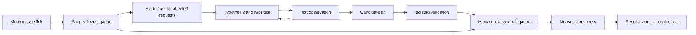

# ReplayOps product review and action backlog

Reviewed 24 September 2026. Method: independent source assessment A (`/root/product_assessment`), independent detector/technical assessment B (`/root/detector_evidence`), and a parent-led live walkthrough of the local synthetic workspace.

**Recommendation: build the product around “understand the failure, choose the next useful test, validate the fix, preserve the evidence.”** The current app has valuable foundations, but too many separate records and some overly strong claims make the workflow harder to understand and trust.

Development effort is assumed to be free, as requested. Priorities therefore reflect customer value, dependencies, correctness, cognitive load, operating costs, and adoption friction—not engineering estimates. This is a product review and proposed backlog, not an implementation change or production certification.

## Review coverage

| Flow | Review performed |
|---|---|
| Operations home | Live UI and source; featured incident, trace, progress, service/traffic panels, activity |
| Incident list/create/edit | Live list and create form; source for saved mutations and lifecycle rules |
| Investigation | Live Diagnose, Decision log, Replay, Verify recovery, Handoff; source across API and storage |
| Evidence | Live timeline and ledger; source for add/edit/delete/move, filtering and provenance |
| Search/assistant/notifications | Live search submission and assistant entry; source for answers, notifications, context and citations |
| Connectors | Live empty/source-selection flow; source for creation, configuration, verification, delivery history and health |
| Workspace | Live service catalog, intake rules, team, audit and delivery queue |
| Authentication/invitations | Source review only; no new accounts, invitations or external messages sent |
| Edge cases | Live unsaved-draft loss and premature search empty state; source analysis for other failure paths |

The existing local servers were reused. No real connector credentials were created, production commands executed, recovery records submitted, or incident data deleted. Existing saved test/replay records were inspected. One unsaved review draft was entered and lost during the tab-switch check; nothing was saved. External OAuth, email delivery, real telemetry ingestion, production database concurrency, mobile and screen-reader behavior were not end-to-end tested.

## What makes the current app confusing

1. **It organizes features before tasks.** The engineer moves between reconstruction, competing hypotheses, tracked tests, a separate decision log, replay, recovery, and handoff while remembering how their states relate.
2. **It mixes observation and inference.** “Causal trace,” “causal confidence,” “model confidence,” and precise recovery gains convey more certainty than the calculations support.
3. **The next action is generic.** The same instruction to validate a hypothesis and run a replay appears regardless of incident state or missing evidence.
4. **State does not reliably follow the investigation.** A previously disproved test was visible while its hypothesis remained ranked first at 78% confidence. Diagnosis receives incident events, not those test outcomes.
5. **Ordinary navigation can lose work.** A typed decision title disappeared after switching to Replay and back. Several other panels similarly hold drafts only in local component state.
6. **Important context is scattered.** Connector setup lives apart from delivery failures and intake policy; evidence details sit below the investigation; operational status changes hide inside Edit.

## Five fixes before relying on the product during a real incident

### 1. Make replay claims match the implementation

`simulateReplay` subtracts fixed retry/concurrency/timeout relief from maximum event impact. Recovery gain is improvement divided by 3.5; confidence rises with event count and a recovery-event bonus. This is an illustrative scenario model, not execution of the application or reproduction of a failure. The UI does disclose that it is deterministic and touches no production system, which should be preserved.

Remove unsupported predictive precision from the operational flow. Rename this capability **Scenario estimate**, show its assumptions, and reserve **Replay test** for an actual isolated run with captured inputs, code version, dependency behavior and observed outputs. Saved configurations/history are worth keeping. A scenario estimate must not itself be presented as proof that a production mitigation will work.

Evidence: [calculation](../apps/api/src/repository.ts#L39), [replay and approval UI](../apps/web/src/components/ResponseConsole.tsx#L89).

### 2. Make test outcomes change the investigation

Unify hypothesis, assigned test, observation, source evidence and conclusion. A disproved hypothesis must visibly become disproved, leave the leading recommendation unless explicitly reopened, and explain the update. A supportive test should increase support only within its scope; it must not automatically establish universal causation. Contradictory tests should produce a contested state. Preserve prior states and rationale.

Evidence: [diagnosis route](../apps/api/src/routes.ts#L132), [test and diagnosis UI](../apps/web/src/components/ResponseConsole.tsx#L23). The contradiction was also visible in the live workspace.

### 3. Require actual recovery evidence

The recovery form starts with observed value 0 and target 1 and immediately declares that the target is met. Its baseline comes from an impact score despite the default metric being an error percentage. The backend accepts the submitted verification status, and resolution requires any historical verified record—even if a more recent observation fails.

Start measurements blank. Require a metric, units, comparison direction, actual observation interval, source/query and current result. Derive verification on the server. Fresh failure should invalidate readiness to resolve. Provide an explicit, audited human override only if a team's incident policy permits closure with an unavailable metric; label it as an exception rather than verified recovery.

Evidence: [form](../apps/web/src/components/ResponseConsole.tsx#L105), [storage and resolution gate](../apps/api/src/workspace.ts#L361).

### 4. Fix time and causal representations

The timeline positions events by array index, so seconds and long gaps occupy equal widths. Its service sequence is not a verified dependency graph. Separately, `formatClock` uses browser-local time, while timeline/handoff text says UTC. For the viewed IST environment this labels local time as UTC, shifting interpretation by 5h30m.

Use an explicit time zone consistently, true elapsed-time spacing with zoom, and distinct visual treatment for observed trace edges, inferred relationships and unrelated events. Until those relationships exist, call the view **Event timeline**.

Evidence: [positions](../apps/web/src/components/CausalTrace.tsx#L60), [service path construction](../apps/api/src/diagnosis.ts#L96), [formatter](../apps/web/src/lib/utils.ts#L8), [handoff](../apps/web/src/components/ResponseConsole.tsx#L114).

### 5. Protect work and make failed actions visible

Persist drafts by incident and form, including after navigation and refresh. Show saving/saved/failed states for decisions, tests, approvals, recovery and postmortems. Preserve entered values on error. Make controls aware of permissions. Replace casual deletion of ingested evidence with exclusion/annotation and a reversible correction history.

Evidence: [panel unmounting](../apps/web/src/components/ResponseConsole.tsx#L126), [event deletion](../apps/web/src/pages/IncidentWorkbenchPage.tsx#L163). Draft loss was reproduced in the browser.

## Recommended product shape

Initial customer hypothesis: teams running API/backend services with existing telemetry who struggle to connect an alert to a defensible explanation and a validated fix. Validate this with design partners; it is not an established market finding.

Default navigation:

- **Investigations** — active incidents, assigned work and searchable past investigations.
- **Sources** — connector setup, receipt verification, signal coverage, intake rules and delivery failures.
- **Settings** — team access, service ownership, privacy, retention and audit.

An incident opens directly to a compact summary: affected service/environment, customer symptom, impact, owner, freshness, current hypothesis and the next useful action. Below it, keep three task areas: **Evidence**, **Investigate**, **Validate & recover**. Handoff is always available; postmortem drafting appears when useful. Tabs are navigation, not a mandatory wizard.

The direct investigation-to-mitigation path matters: urgent impact reduction should not require proving a root cause or completing a synthetic replay first. Keep a reasoned record and apply the organization's approval policy. Investigation can continue while recovery is monitored. This aligns with the emphasis on stopping impact first in [Google's incident-response workbook](https://sre.google/workbook/incident-response/).

## Complete action backlog

Priority meanings: **P0 = trust/correctness blocker before production reliance; P1 = core startup workflow; P2 = expansion once the core is useful.** These are product release priorities, not a claim that a production outage has already occurred. “Remove” generally means remove from the default operational experience, not discard useful underlying data.

### Remove, merge or demote

| ID | Priority | Action | Target behavior / completion criterion |
|---|---|---|---|
| 01 | P0 | Remove fabricated replay progress | Delete the hard-coded 68% in-progress status. Show a real job's state, or a clearly static demo illustration separated from operational status. |
| 02 | P1 | Demote generic dashboard charts | Home prioritizes active incidents, my tests, pending decisions and source health. Retain charts only where they answer a scoped incident question and identify their source/window/freshness. |
| 03 | P1 | Merge hypotheses, tests and reasoning records | One investigation record owns explanation, test, evidence and conclusion. Generate decision history automatically; ordinary notes remain possible. No duplicate manual “hypothesis” form. |
| 04 | P1 | Make AI contextual | Replace competing global-chat/draft/challenge entry points with Explain evidence, Challenge hypothesis, Suggest next test and Summarize changes. Show incident and evidence version; isolate conversations by incident. |
| 05 | P1 | Merge connector administration | Sources contains setup, verification, coverage, intake policy and delivery troubleshooting with direct links between delivery, event and incident. |
| 06 | P1 | Replace internal jargon | Use Event timeline, Investigation, Next test, Sources and Scenario estimate. Explain advanced statistical terms inline; do not require learning “proof loop,” “falsification,” or “counterfactual” to operate the app. |
| 07 | P0 | Remove unsupported score precision | Retire uncalibrated causal/replay percentages and predicted recovery minutes from default conclusions. Replace with evidence status, unknowns and reasons; expose heuristic ranking as a ranking, not probability. |
| 08 | P1 | Remove impact sliders and destructive controls from routine evidence work | Infer triage priority from actual signals and customer impact when possible; keep documented overrides separate. Ingested evidence is annotated/excluded with history; manual mistakes support undo. |

### Improve the existing end-to-end flow

| ID | Priority | Action | Target behavior / completion criterion |
|---|---|---|---|
| 09 | P1 | Add a first-success onboarding path | Choose source → receive real event → inspect incident. Keep a separate sample investigation. A local synthetic self-test never claims that the customer's sender is connected. Include password recovery and clear invitation destination/role. |
| 10 | P1 | Simplify intake and lifecycle controls | Start from alert/trace URL or a short symptom. Infer service, time and ownership where possible; allow unknown owner/service. Expose Assign, Start monitoring, Resolve and Reopen directly rather than only inside Edit. |
| 11 | P1 | Make the incident list actionable | Views for Mine, Unassigned, Active, Waiting on a test and Recently resolved. Show user impact, environment, owner, last meaningful change and next task. Include service/severity/time filters. |
| 12 | P1 | Make the next action state-aware | Missing trace → fetch/open trace; disproved hypothesis → next candidate; approval waiting → reviewer; recovery failed → keep monitoring. A direct button opens the exact task. Urgent mitigation remains possible. |
| 13 | P0 | Correct timeline semantics and time zones | Shared UTC/local selection, date/offset in exports, true elapsed-time axis and separate inferred/observed links. Dense events support zoom and aggregation. |
| 14 | P1 | Unify timeline and evidence inspector | Selecting a node opens the exact log/span/change, timestamp, source, attributes and provenance in a side panel. Selecting a citation clears obstructing filters or explains why its event is hidden. |
| 15 | P0 | Incorporate observed test outcomes | Supported/disproved/inconclusive/contested outcomes update visible hypothesis state and the next recommendation. Require evidence/rationale; preserve revisions and prevent accidental duplicate tests. |
| 16 | P1 | Expose evidence gaps and changes | Display the existing evidence-gap output and descriptive signal deltas with a concrete way to acquire missing data. Current impact-score deltas must not be labeled statistically measured cohort differences. |
| 17 | P0 | Make scenario controls honest and applicable | Hide retry/concurrency knobs for unrelated incidents. Show the target, current configuration, candidate values, model assumptions and unsupported cases. Record what was estimated versus actually executed. |
| 18 | P0 | Rebuild recovery verification | Blank observations, actual metric units/direction, fixed interval, source/query, freshness, server-derived result and regression detection. An old pass cannot override a newer failure. |
| 19 | P1 | Make mitigation approval concrete | Review named service/environment, exact action, actual prior values, rollback, blast radius, owner and evidence version. Show requester/reviewer requirements before submission. Policy determines whether review is required; small teams need an explicit permitted self-review mode or external approval record, never a hidden bypass. |
| 20 | P1 | Preserve drafts and share exact locations | Incident-scoped autosave, unsaved-state protection, URL-addressable tabs/tests/approvals, and preserved filters/selection. Browser back and refresh resume the investigation. |
| 21 | P1 | Complete action feedback and permissions | Every mutation shows pending/success/error with retry. Viewers see read-only controls; responders see who may approve. Permission failures do not erase completed forms. |
| 22 | P1 | Fix search behavior | Distinguish not searched, loading, no result and error; do not show no matches while merely typing. Exact ID/service/trace searches coexist with semantic search. Results open exact evidence and preserve query context. |
| 23 | P1 | Make notifications actionable | Open the exact assigned test, approval or failed delivery. Include incident, owner, urgency and reason; support read/resolved state and avoid repeated irrelevant alerts. |
| 24 | P1 | Upgrade handoff and postmortem | Lead with what is known, unknown, tried, disproved and next, with owners and source links. Mark stale replay evidence. Allow unresolved root cause; separate quick shift handoff from detailed postmortem editing. Follow-ups become structured owners/dates/statuses. |
| 25 | P1 | Make source health specific to the source | Separate received/normalized/correlated/rejected/dropped states. A quiet deployment webhook is not automatically broken after three hours. Provide expected cadence, coverage, failure reason and retry from the source page. |
| 26 | P1 | Make rules and service context reviewable | Discover service names/owners from telemetry and allow correction. Preview which events a proposed intake/grouping policy would affect. Surface repository and runbook links inside the incident. Provide merge/split/move with preview and reversible provenance. |

### Add capabilities that directly help production debugging

| ID | Priority | Action | Target behavior / completion criterion |
|---|---|---|---|
| 27 | P1 | Healthy-versus-failing request comparison | Compare matched cohorts by release, route, dependency, tenant, region and instance. Show sample counts, time windows, denominators and sampling bias. Retain a bounded healthy sample or query the customer's source on demand. Current OTLP intake drops healthy fast spans. |
| 28 | P1 | Unified recent-change view | Correlate deployments, commit/config diffs, feature flags, schema changes and infrastructure events. Show relevance and evidence against each candidate; chronological proximity alone is not causation. Start with GitHub plus one design partner's actual change systems. |
| 29 | P1 | Actionable next-test queries | Generate a source-specific read-only query or deep link with service, environment and time window filled in. Show expected observations that would support/disprove the hypothesis. Saved results attach back to the test. |
| 30 | P1 | Failing-request evidence bundle | One shareable, access-controlled package with request/trace, relevant logs, deployed version, dependency behavior, environment and omissions. Scrub secrets; distinguish metadata-only evidence from replayable payloads. |
| 31 | P2 | Real isolated replay | Reproduce captured requests against a specific code/config revision with mocked or controlled dependencies. Record assertions, outputs, limitations and nondeterminism. Begin with HTTP/API failures; explicitly mark distributed races or uncaptured state unsupported. |
| 32 | P2 | Turn incidents into regression tests | A reproduced failure becomes a versioned test: fail on old build, pass on candidate, run in CI, link to incident. Distinguish actual verified tests from AI-suggested drafts. Depends on reliable capture and replay. |
| 33 | P1 | Useful historical incident comparison | Automatically suggest similar resolved incidents with matching and differing evidence, tested mitigations and conditions where they failed. Do not copy prior conclusions simply because symptoms sound similar. |
| 34 | P1 | Measured customer impact | Show affected request rate, endpoints, regions/tenants and failed user journeys when those dimensions exist. Include time window and denominator. Report unknown impact honestly; do not invent revenue loss. |
| 35 | P2 | Lightweight collaboration with existing tools | Evidence-linked comments, mentions, owner handoff and export/integration to the team's existing incident chat and issue tracker. Keep reasoning in one place without building paging, chat, status pages or a complete issue tracker. |
| 36 | P1 | Measure the product's actual usefulness | Instrument time to first useful evidence/test, repeated failed actions, draft loss, manual copying, hypothesis revisions and reused validated fixes. Evaluate with known incidents and customer walkthroughs. Do not use AI messages or generated hypotheses as success metrics. |

### Foundations required for customers to trust it

| ID | Priority | Action | Target behavior / completion criterion |
|---|---|---|---|
| 37 | P0 | Enforce a consistent data boundary | Redact before embeddings as well as chat requests. Make source/provider access and capture policy explicit; offer customer-controlled collectors and provider-disabled operation. Verify secret/PII handling with representative fixtures. |
| 38 | P0 | Bind results to a consistent evidence snapshot | Transactional/version-checked replay persistence and approvals; immutable input snapshots; separate evidence revisions from title/owner edits. Environment/service identity must scope incident matching and precursor backfill. |
| 39 | P1 | Budget telemetry and preserve provenance | Explicit retention, sampling, per-source quotas and deletion policies; preserve necessary originals and correction history according to policy. Show dropped data and estimated coverage, and support source queries instead of retaining everything. |
| 40 | P1 | Make the tool dependable under incident load | Server-side pagination/windowed evidence, bounded polling, stale/offline indicators, observable queue health and retry. Keyboard/focus testing, readable labels and large hit targets. Mobile should prioritize triage, approval and handoff. Validate with realistic large incidents and an always-available pilot environment. |

## What I would deliberately avoid adding

- A replacement for Datadog/Grafana/Honeycomb's full monitoring and query stack.
- A full paging, on-call scheduling, status-page, chat or project-management suite.
- A generic autonomous “fix production” button driven by uncalibrated AI confidence.
- A universal distributed-system digital twin before one narrow replay workload has demonstrated useful fidelity.
- More charts, confidence badges or AI entry points without a specific unanswered responder question.

These are scope choices even with free development. Every feature still consumes attention, onboarding effort, operating capacity and product trust.

## What to keep

Retain signed/deduplicated intake, automatic precursor attachment, exact evidence citations, alternative explanations, disconfirming evidence, explicit test owners/outcomes, saved configuration history, evidence freshness checks, team permissions, audited decisions, provider-optional operation and portable handoff. The differentiating idea is a continuously updated, reviewable investigation—not the number of features.

## Delivery sequence and release gates

1. **Trust gate:** complete 01, 07, 13, 15, 17, 18, 37 and 38; address lost drafts and silent failures from 20–21. A disconfirmed hypothesis cannot remain silently authoritative; recovery cannot pass without a valid observation; local time is never mislabeled UTC; an estimate never masquerades as a test.
2. **Core workflow gate:** merge the concepts and navigation in 03–06; implement 09–12 and 14–26. A new responder should find the affected service, evidence, unknowns and next action without a narrated tour. Validate by observing representative users, not by counting screens.
3. **Debugging-value gate:** ship 27–30, 33–34 and 36 with a small set of design partners. Confirm these reduce investigation effort against the partners' existing workflow. Use matched incident exercises and qualitative observation before claiming MTTR improvement.
4. **Differentiation gate:** add 31–32 and 35 after capture fidelity and the basic workflow are trusted. Demonstrate a recorded failure that reproduces on the old build and passes on the candidate, with explicit unsupported cases.

Suggested usability tasks: connect one real source; locate a failing request; compare a healthy cohort; record a disproving test and observe the update; request a concrete mitigation review; verify recovery; hand off to another engineer without verbal explanation. Include missing telemetry, stale evidence, rejected permission, lost network and newly failing recovery cases.

Suggested product targets are hypotheses, not promises: first useful investigation within ten minutes of receiving valid telemetry; next relevant evidence reachable in at most two actions from the incident; zero silent draft loss; all conclusions explain their evidence boundary. Set actual targets with pilot data.

## Supporting product research

- [Google SRE: Incident response](https://sre.google/workbook/incident-response/) supports prioritizing stopping customer impact while diagnosis proceeds. This informs the non-linear mitigation path.
- [Honeycomb: Identify outliers](https://docs.honeycomb.io/investigate/analyze/identify-outliers/) documents comparing an unusual subset with a baseline. This informs the healthy/failing comparison recommendation; it does not establish that ReplayOps should rebuild Honeycomb.
- [Keploy documentation](https://keploy.io/docs/) describes capture and replay of application behavior and dependencies for API regression testing. This is useful category evidence for the distinction between ReplayOps' current scenario arithmetic and executed replay tests. It is not a claim that all production incidents can be replayed deterministically.

## Heuristic assessment

Provisional source-led scores, supplemented by the parent browser walkthrough. Scale: 0–4, where 4 is excellent. These are expert judgments, not measured user-study results or an accessibility certification.

| Heuristic | Score | Main issue |
|---|---:|---|
| Visibility of status | 2 | Static progress and missing mutation feedback undermine otherwise useful refresh states. |
| Match to real-world task | 1 | Causal/predictive labels exceed supporting observations. |
| Control and freedom | 2 | Draft loss and irreversible-looking evidence controls. |
| Consistency | 2 | Hypothesis, conclusion and approval have overlapping but disconnected states. |
| Error prevention | 1 | Recovery defaults can imply success without entered measurements. |
| Recognition over recall | 2 | Context and next steps are distributed across panels. |
| Efficiency | 2 | Some shortcuts exist; deep-linked work and dense evidence handling need improvement. |
| Minimalism | 2 | Specific investigation UI is diluted by generic dashboard panels and duplicated forms. |
| Error recovery | 1 | Several core actions lack a visible failure/retry path. |
| Help and guidance | 2 | Setup guidance exists; interpretation of scores and replay assumptions is weak. |
| **Total** | **17/40** | **Functional foundations, substantial task and trust issues.** |

The visual identity itself is reasonably specific: restrained operational colors, service lanes and explicit evidence. A cosmetic redesign should follow the workflow repairs. The detector reported eight advisories, no blocking findings: six 10px font deviations (trace, dashboard and login); one trace-grid warning that conflicts with this product's expressly permitted measurement grid; one negligible scrollbar radius difference. Automated style checks do not detect the principal product issues above.

Persona risks: an on-call engineer cannot afford contradictory test state or lost notes; an incident commander needs source-linked pending work and owners; a first-time user needs proof that real telemetry arrived rather than merely a successful self-test.

## Source evidence index

| Finding | Implementation location |
|---|---|
| Static 68% replay progress | `apps/web/src/pages/DashboardPage.tsx:90` |
| Constant next-action text | `apps/web/src/pages/IncidentWorkbenchPage.tsx:134` |
| Independent test records/diagnosis input | `apps/web/src/components/ResponseConsole.tsx:23`; `apps/api/src/routes.ts:132` |
| Heuristic confidence and keyword baseline detection | `apps/api/src/diagnosis.ts:7`, `:95` |
| Uniform timeline spacing | `apps/web/src/components/CausalTrace.tsx:60`, `:84` |
| Local-time formatter labeled UTC downstream | `apps/web/src/lib/utils.ts:8`; `apps/web/src/components/ResponseConsole.tsx:114` |
| Scenario arithmetic and confidence | `apps/api/src/repository.ts:39` |
| Replay persistence version race | `apps/api/src/repository.ts:571` |
| Recovery form defaults / historical pass gate | `apps/web/src/components/ResponseConsole.tsx:106`; `apps/api/src/workspace.ts:362`, `:368` |
| Unmounted local drafts | `apps/web/src/components/ResponseConsole.tsx:126` |
| Search empty before submission | `apps/web/src/components/CommandSearch.tsx:76` |
| Connector cadence and self-test | `apps/web/src/pages/IntegrationsPage.tsx:14`, `:146` |
| Healthy spans filtered out | `apps/api/src/ingestion.ts:179` |
| Environment retained but absent from matching predicate | `apps/api/src/repository.ts:712` |
| Unredacted embedding input | `apps/api/src/ai.ts:22` |

## Run notes

Target: `apps/web/src/App.tsx`; archive slug `apps-web-src-app-tsx`. No critique ignore file was present. Assessments A and B were assigned isolated source/detector tasks; visual inspection was parent-led rather than duplicated in each agent. This is a product-focused adaptation of the skill workflow. The browser API supports read-only evaluation, so no detector overlay was injected; screenshots, accessibility/DOM state and source inspection were used instead. No critique server was started, and existing application servers were left untouched. No production changes were made. Historical trend comparison was not used. Questions skipped: the user requested a complete recommendation list; no answer is necessary to deliver this review.
